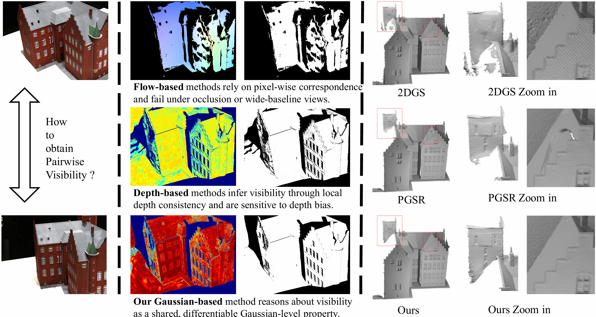

# GVGS: Gaussian Visibility-Aware Multi-View Geometry for Accurate Surface Reconstruction
Anonymous submission.

<p align="center">
  
</p>
We propose GVGS, a Gaussian Visibility-Aware Multi-View Geometry for Accurate Surface Reconstruction. GVGS leverages the visibility information from the 3D Gaussian primitives to enhance the multi-view geometry constraints, and achieves state-of-the-art performance on both DTU and Tanks and Temples datasets.

## Results
The Chamfer Distance↓ on the DTU dataset
|     | 24| 37| 40| 55| 63| 65| 69| 83| 97|105|106|110|114|118|122|**Mean**|
|-------|---|---|---|---|---|---|---|---|---|---|---|---|---|---|---|---|
|GVGS|0.33|0.54|0.34|0.32|0.79|0.52|0.47|1.04|0.62|0.58|0.38|0.55|0.30|0.34|0.33|**0.50**|


The F1 Score↑ on the TnT dataset
| Scene        | F1 Score |
|--------------|----------|
| Barn         | 0.58     |
| Caterpillar  | 0.47     |
| Courthouse   | 0.24     |
| Ignatius     | 0.81     |
| Meetingroom  | 0.39     |
| Truck        | 0.68     |
| **Mean**     | **0.53** |


## Installation
```shell
conda create -n gvgs python=3.8
conda activate gvgs

pip install torch torchvision torchaudio --index-url https://download.pytorch.org/whl/cu118 #replace your cuda version
pip install -r requirements.txt
pip install submodules/diff-plane-rasterization
pip install submodules/simple-knn
```

## Dataset Preprocess
### Data Download
Please download the preprocessed DTU dataset from [2DGS](https://surfsplatting.github.io/), and download the ground truth point clouds from the [DTU dataset](https://roboimagedata.compute.dtu.dk/?page_id=36). Download the Tanks and Temples dataset preprocessed by [GOF](https://github.com/autonomousvision/gaussian-opacity-fields), and the GT of Tanks and Temples dataset from [official webiste](https://www.tanksandtemples.org/download/). 

The data folder should like this:
```shell
data
├── DTU
│   ├── dtu
│   │   ├── scan24
│   │   │   ├── images
│   │   │   ├── mask
│   │   │   ├── sparse
│   │   │   ├── cameras_sphere.npz
│   │   │   └── cameras.npz
│   │   └── ...
│   ├── dtu_eval
│   │   ├── Points
│   │   │   └── stl
│   │   └── ObsMask
├── TNT
│   ├── TrainingSet
│   │   ├── Ignatius
│   │   │   ├── images
│   │   │   ├── sparse
│   │   │   ├── train
│   │   ├── ...
│   └── GT
│       ├── Ignatius
│       │   ├── images
│       │   ├── masks
│       │   ├── normals
│       │   ├── sparse
│       │   ├── Ignatius_COLMAP_SfM.log
│       │   ├── Ignatius.json
│       │   ├── Ignatius.ply
│       │   ├── Ignatius_trans.txt
│       │   ├── Ignatius_mapping_reference.txt
│       │   ├── meta.json
│       │   ├── pinhole_dict.json
│       │   ├── transforms.json
│       │   ├── run-colmap-geometric.sh
│       │   └── run-colmap-photometric.sh
│       └── ...
```

### Monocular Depth Generation
For each dataset, monocular depth is generated following the procedure described in [Citygs-X](https://github.com/gyy456/CityGS-X?tab=readme-ov-file#depth-regularization). 

```shell
conda activate citygx-x
mkdir -p TNT/TrainingSet/${tntid}/train/depths
ln -s TNT/TrainingSet/${tntid}/images TNT/TrainingSet/${tntid}/train/rgbs
python Depth-Anything-V2/run.py --encoder vitl --pred-only --grayscale --img-path TNT/TrainingSet/${tntid}/train/rgbs --outdir TNT/TrainingSet/${tntid}/train/depths
python utils/make_depth_scale.py --base_dir TNT/TrainingSet/${tntid} --depths_dir TNT/TrainingSet/${tntid}/train/depths
```

## Training and Evaluation
### DTU
```shell
python scripts/run_dtu_multi_gpu.py \
    --out_base_path ./output_dtu \
    --data_base_path data/DTU/dtu \
    --eval_path data/DTU/dtu_eval/Points/stl \
    --out_name test 
```

### TNT
```shell
python scripts/run_tnt_multi_gpu.py \
    --out_base_path ./output_tnt \
    --data_base_path data/TNT/TrainingSet \
    --eval_path data/TNT/GT \
    --out_name test 
```


## Acknowledgements
This project builds upon [3D Gaussian Splatting (3DGS)](https://github.com/graphdeco-inria/gaussian-splatting) and [PGSR](https://github.com/zju3dv/PGSR).  
The Gaussian influence implementation is adapted from [efficientgaussian](https://github.com/Sharath-girish/efficientgaussian).  
Data preprocessing for the DTU and Tanks and Temples datasets follows the pipelines of [2DGS](https://surfsplatting.github.io/) and [GOF](https://github.com/autonomousvision/gaussian-opacity-fields).  
Evaluation on DTU and Tanks and Temples is conducted using scripts adapted from [DTUeval-python](https://github.com/jzhangbs/DTUeval-python), [TanksAndTemples](https://github.com/isl-org/TanksAndTemples/tree/master/python_toolbox/evaluation), and [QGS](https://github.com/will-zzy/QGS).  
Monocular depth priors are generated based on [CityGS-X](https://github.com/gyy456/CityGS-X?tab=readme-ov-file#depth-regularization) and [Depth Anything V2](https://github.com/DepthAnything/Depth-Anything-V2).  

We sincerely thank all the authors for releasing their excellent work and codebases.
